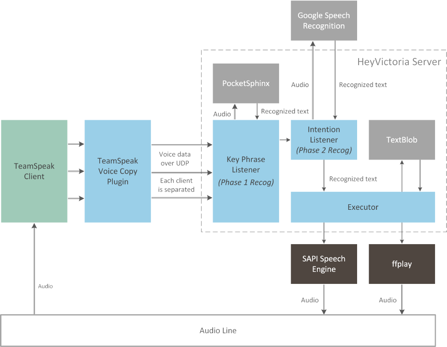

# Hey Victoria

Hey Victoria is an experimental English-understanding speech recognition assistant that connects to a TeamSpeak 3 channel. She is controlled entirely through speech.

* Each user in the channel is listened to individually and can interact with the assistant even when others are speaking.
* The assistant is continually listening, but is triggered by mentioning her name, after which she accepts a spoken instruction.
* Upon hearing her name, she will emit a sound to indicate that she is recording, followed by a different sound when she has realized that the person has finished spoken.

Examples of commands that Victoria can currently understand include:

* *Hey Victoria, can you play Satellite Stories Helsinki Art Scene?*
* *Victoria, can you YouTube Brand New?*
* *Ok Victoria, stop playback please.*
* *Victoria, repeat "Meat bags should watch out."*

The project is currently in a proof-of-concept state and is rough around the edges.

## Architecture

In order to record what is spoken, a TeamSpeak plugin is currently used due to the lack of a library to connect to a TeamSpeak server.

Each user's voice data is sent to a listening server that performs the necessary speech recognition.



Currently the client needs to run on the same system and user account as the TeamSpeak client. In addition, the default audio output device must be set as the default capture device in TeamSpeak. Some of Victoria's components **currently require Microsoft Windows**.

## Prerequisites

* Microsoft Windows
* Microsoft Visual Studio ([get VS Express](https://www.visualstudio.com/en-us/products/visual-studio-express-vs.aspx))
* 32-bit Python 2.7
* Visual C++ Redistributable ([if using VS 2013](https://www.microsoft.com/en-us/download/details.aspx?id=40784))

Python libraries:

* SpeechRecognition (`pip install speechrecognition`)
* pyttsx (`pip install pyttsx`)
* TextBlob (`pip install textblob`)
* Google Data API Client (`pip install google-api-python-client`)
* pyaudio ([download binaries](https://people.csail.mit.edu/hubert/pyaudio/#downloads))
* Python for Windows Extensions ([download binaries](http://sourceforge.net/projects/pywin32/files/pywin32/))
* pocketsphinx ([follow README](https://github.com/cmusphinx/pocketsphinx-python))

Supporting software:

* youtube-dl ([download binaries](https://rg3.github.io/youtube-dl/))
* ffmpeg/ffplay (find unofficial binaries)

Data:

* NLTK corpora (`python -m textblob.download_corpora`)
* PocketSphinx data ([from its Git repo](https://github.com/cmusphinx/pocketsphinx))

API keys:

* YouTube API access key ([use Google Console](https://code.google.com/apis/console/))

## Installation

Everything should be run on the same user account in Windows, and TeamSpeak should be configured to capture the output of the default audio output device.

### Voice Copy Plugin

The Voice Copy plugin is the TeamSpeak plugin component.

1. Compile the solution found in the ts3_voice_copy/ folder. Remember to select the appropriate architecture for your TeamSpeak client version (Win32 or x64).
2. Install the plugin found in the bin/ folder into TeamSpeak.
3. Enable the plugin in TeamSpeak.

By default, the voice copy plugin is configured to send voice data to port 32000 at 127.0.0.1. To adjust this, change plugin.c appropriately.

### Listen Server

Inside the listen_server/ folder:

* Place into pocketsphinx/ the model/ and test/ folders from the pocketsphinx project (see prerequisites above).
* Place ffplay.exe and youtube-dl.exe into the bin/ folder.

Create a config.ini file and in it, place:

```ini
[server]
host=127.0.0.1
port=32000

[youtube]
apiKey=
```

Configure the values and enter your YouTube API key.

Run listen.py with the path to the configuration file: `python listen.py config.ini`

On initial start, something should be said over text to speech and the beep sounds should be heard.

## Usage

Victoria works best in a channel set to the Opus Music audio quality setting. Other codecs significantly degrade the ability for the assistant to detect the key phrase. 

If the key phrase ("Victoria") is heard, **a beep sound should be heard**. A command must be then said afterwards, taking into consideration that sentences are recognized better than single word commands. However, ultimately Victoria is looking for a specific word to decide what to do.

Once the speaker has finished talking, Victoria will **sound another beep** a second or two after silence had started. Victoria will also eventually stop listening if the speaker does not seem to stop speaking.

The first invocation of the speech recognition engine may have very poor results. Try again a second time.

Commands currently include:

* "say," or "repeat" followed by the text for Victoria to speak using TTS
* "youtube," or "play" followed by a search query to play a YouTube video
* "stop" to stop playing anything currently playing

The flow of interaction is:

1. The speaker mentions "Victoria"
2. A sound is emitted indicating recognition
3. The speaker mentions a command
4. The speaker stops speaking
5. A different sound is emitted indicating that the recording has finished
6. The assistant responds accordingly

If the command portion is not recognized or an unknown command is mentioned, then Victoria will say so using text-to-speech.

## License

Hey Victoria is licensed under [GNU Lesser General Public License v3](https://www.gnu.org/licenses/lgpl-3.0.en.html).

## Credits

The sounds are sourced from:

* [pan14](https://www.freesound.org/people/pan14/)
